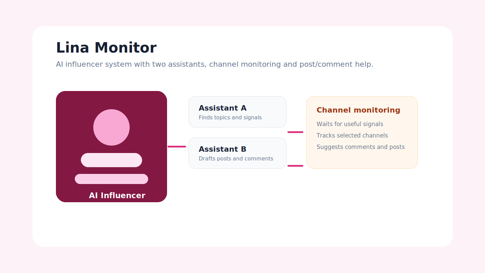

# AI Automation Case Studies

Case studies and public notes for AI automation work: lead handling, old-lead reactivation, self-hosted n8n systems and AI influencer monitoring.

## Public Links

- Portfolio: https://kaimiewl.github.io/#work
- Lina Monitor: https://n8ncodex.freen8n.space/lina-monitor/
- n8n Codex instance: https://n8ncodex.freen8n.space/
- Free n8n instance: https://freen8n.space/

The n8n instances are login-protected. This repo keeps the public explanation without exposing credentials or private workflows.

## What It Shows

This is the business-facing side of the automation work: what problem the automation solves, how the workflow is structured, what is safe to publish and what stays private.

## Included Areas

- AI lead qualification
- Old-lead reactivation
- Lina Monitor: AI influencer workspace with two assistant agents
- Channel monitoring, post drafting and comment suggestions
- Self-hosted n8n operations with separated instances
- Workflow specs, handoff rules and implementation backlog

## Stack

n8n, API integrations, AI workflow design, CRM operations, monitoring dashboards, product strategy.

## How To Read

Start with `docs/architecture.md`, then open the case-study documents in `docs/`.

## Status

Case-study export. No credentials, workflow secrets, local databases, cookies, private logs or runtime artifacts are published.
